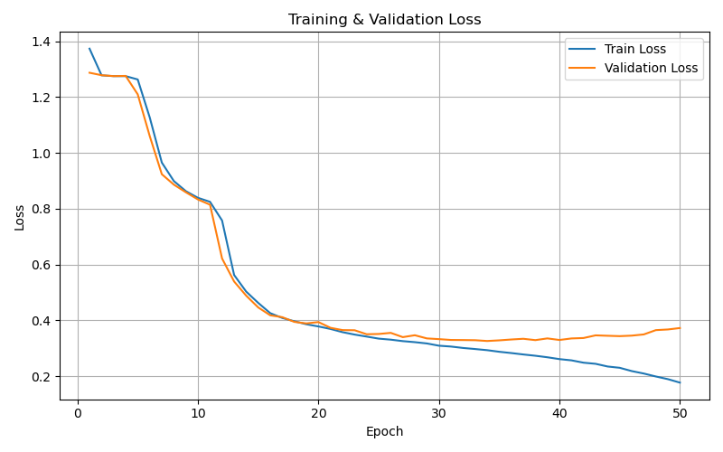

# Pointer Network

In this respository you can find pytorch implementation of [Pointer Network](https://arxiv.org/abs/1506.03134), especially to solve Traveling Salesman Problem. 

## Architecure
### Encoder
* bidirectional LSTM
* hidden size : 256

## Result

