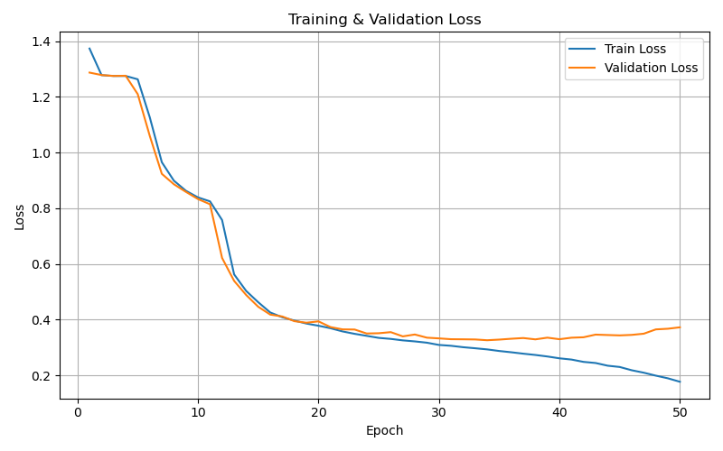

# Pointer Network

In this respository you can find pytorch implementation of [Pointer Network](https://arxiv.org/abs/1506.03134), especially to solve Traveling Salesman Problem. 

## Architecure
### Encoder
* bidirectional LSTM
* hidden size : 256
provide embedding vectors of input cities coordinates

### Decoder
* LSTM
* hidden size : 256
after passing LSTM layer, it produces next input using Attention mechanism

### Pointer Attention

## Result

