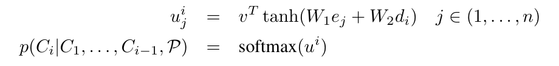
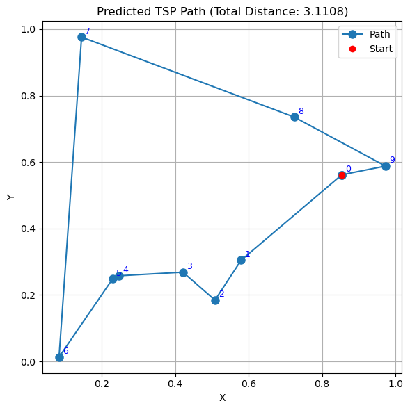
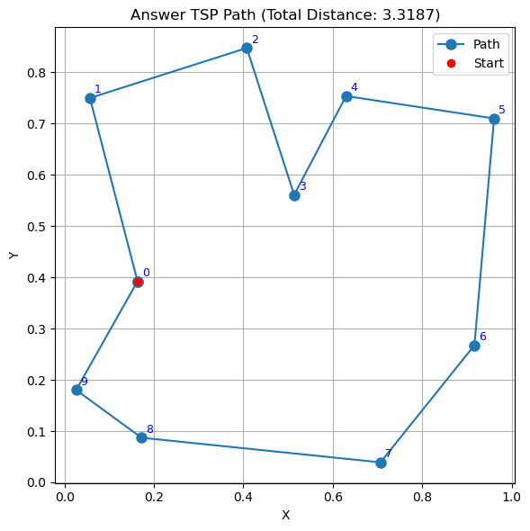
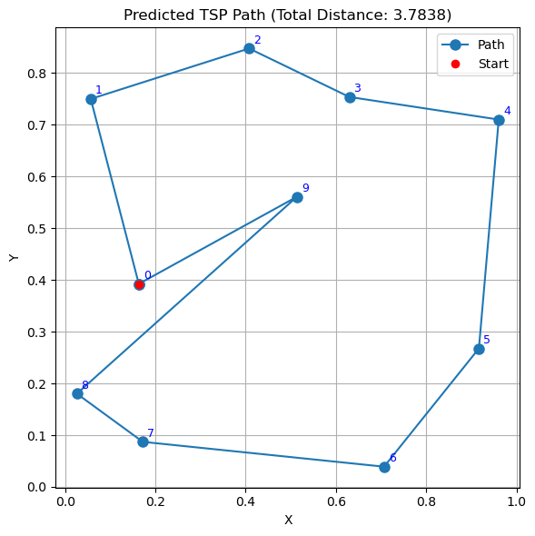
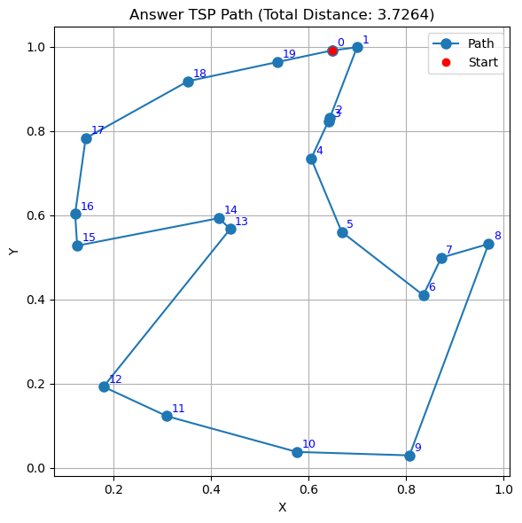
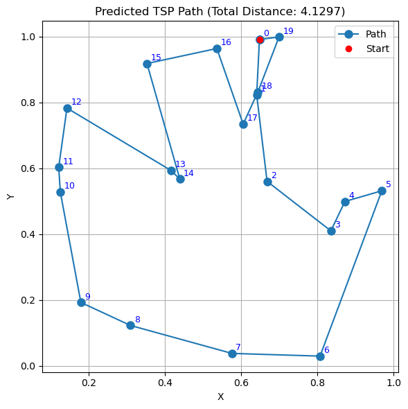

# Pointer Network

In this respository you can find pytorch implementation of [Pointer Network](https://arxiv.org/abs/1506.03134), especially to solve Traveling Salesman Problem. 

## Architecure
### Encoder
* bidirectional LSTM
* hidden size : 256 

provide embedding vectors of input cities coordinates

### Decoder
* LSTM
* hidden size : 256 

after passing LSTM layer, it produces next input using Attention mechanism

### Pointer Network Attention

given decoder i, it calculates attention scores related with encoder state j(s) 

then choose largest score's index among softmax distribution as a next city index

## Data
dataset can be found in [here](https://drive.google.com/drive/folders/0B2fg8yPGn2TCMzBtS0o4Q2RJaEU?resourcekey=0-46fqXNrTmcUA4MfT6GLcIg)

## Result

### Test on 10 cities (same number of cities as train)
#### Best Result

  
  

#### Another Result

  
  

### Test on 20 cities (more instances than train)

  
  

## Thoughts
